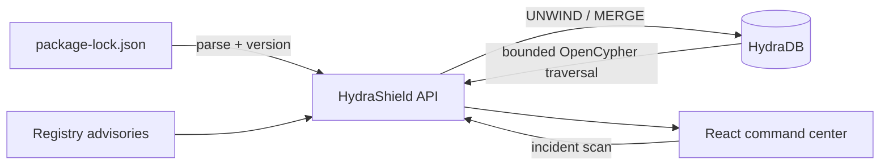

# HydraShield

HydraShield is a graph-native incident response console for software supply-chain attacks. It answers the question defenders face when an advisory lands: **which services resolve the vulnerable version, through which exact dependency paths, and what should we contain first?**

Built for Hack Hydra 2026, Track 02A: Supply-chain blast radius.

**Live demo:** [hydra-shield-six.vercel.app](https://hydra-shield-six.vercel.app)

**Source:** [github.com/taranggoyal70/hydra-shield](https://github.com/taranggoyal70/hydra-shield)

**Ground truth:** [GHSA-c2qf-rxjj-qqgw](https://osv.dev/vulnerability/GHSA-c2qf-rxjj-qqgw), alias CVE-2022-25883, affects the demonstrated `semver@7.3.7` and is fixed in `7.5.2`.

## Judge fast path

1. Open the live demo and follow the real OSV advisory into five exact service paths.
2. Inspect [`/api/advisory`](https://hydra-shield-six.vercel.app/api/advisory) for normalized OSV/GitHub Advisory evidence.
3. Inspect [`/api/evaluation`](https://hydra-shield-six.vercel.app/api/evaluation) for the labeled correctness corpus and timing distribution.
4. Run locally with Docker to see the same scan execute against HydraDB with causal reads and a real read epoch.

## The demo

The included incident combines a real, GitHub-reviewed public advisory with a clearly labeled simulated enterprise dependency estate. HydraShield:

1. Traverses up to five dependency hops in one bounded OpenCypher query.
2. Returns every affected service and its owner, criticality and exact install path.
3. Correlates the affected package with a one-edit typosquat candidate.
4. Generates a prioritized, interactive containment plan.
5. Imports real npm v2/v3 `package-lock.json` files into HydraDB.
6. Fetches and normalizes live OSV evidence, then links exact lockfile versions to vulnerability nodes.
7. Reports precision, recall, F1, query latency and bounded query counts without inventing cost data.

## Why HydraDB is essential

A vector index can find packages with similar descriptions. It cannot prove that a service resolves a vulnerable version through four transitive dependencies. HydraShield stores services, versioned packages, maintainers and vulnerabilities as nodes, with `DEPENDS_ON`, `MAINTAINS`, `AFFECTED_BY` and `SIMILAR_TO` relationships.

The central blast-radius query is executed by HydraDB:

```cypher
CALL algo.SSpaths({
  sourceNode: $badId,
  relTypes: ['DEPENDS_ON'],
  relDirection: 'incoming',
  maxLen: 5,
  pathCount: 100,
  resultLimit: 1000
})
YIELD path
RETURN path
```

HydraDB contributes bounded variable-length traversal, reverse adjacency, durable object-store-backed graph state, and snapshot-consistent causal reads. Without it, the product loses its core claim: exact, explainable transitive exposure at incident speed. The deterministic fallback exists only so the public Vercel UI remains reviewable when a stateful HydraDB node is not attached.

## Architecture



- **Web:** React 19, Vite, custom SVG dependency topology
- **API:** Express 5 and TypeScript
- **Graph:** HydraDB HTTP query API using causal, snapshot-consistent reads
- **Tests:** Vitest for lockfile ingestion and transitive closure correctness

## Run locally

Prerequisites: Node.js 22+, npm and Docker.

```bash
npm install
npm run setup:hydra
HYDRA_UID=$(id -u) HYDRA_GID=$(id -g) docker compose up -d hydradb
npm run seed
npm run dev
```

Open [http://localhost:5173](http://localhost:5173). The API runs at `http://127.0.0.1:8787` and HydraDB at `http://127.0.0.1:8443`.

HydraShield automatically seeds the demonstration graph when HydraDB is ready. If HydraDB is not running, the product remains explorable using a clearly labeled deterministic demo snapshot. Lockfile imports are only persisted when HydraDB is live.

Run the real-engine benchmark after seeding:

```bash
npm run benchmark:hydra
```

On the included 18-entity graph, a local 50-run causal-read sample measured 0.96 ms p50 and 1.83 ms p95 on the development machine. Re-run the command on your hardware rather than treating those numbers as universal.

## Deploy to Vercel

Vercel serves the Vite client from its CDN and routes `/api/*` to the Express entrypoint at `api/index.ts`, keeping the product on one deployment and one origin.

```bash
vercel link
vercel build --prod
vercel deploy --prebuilt --prod
```

Vercel hosts the full-stack React and Express application. A HydraDB node is a long-lived stateful service, so the public deployment uses the clearly labeled deterministic reference mode unless a separately hosted HydraDB endpoint is supplied through the `HYDRA_*` variables. The local Docker path is the reproducible real-backend proof.

## Environment

The defaults match `docker-compose.yml`.

| Variable | Default | Purpose |
| --- | --- | --- |
| `HYDRA_URL` | `http://127.0.0.1:8443` | HydraDB HTTP endpoint |
| `HYDRA_ADMIN_URL` | `http://127.0.0.1:9090` | HydraDB readiness endpoint |
| `HYDRA_TOKEN` | generated local token or unset | Bearer token for a remote HydraDB deployment |
| `HYDRA_NAMESPACE` | `hydrashield` | Graph namespace |
| `HYDRA_GRAPH_ID` | `default` | Graph identifier |
| `HYDRA_CELL_ID` | `cell-0` | HydraDB cell |
| `PORT` | `8787` | API port |

`npm run setup:hydra` writes a random, ignored local token to `.hydradb/auth-token`. Never commit production credentials.

## Verification

```bash
npm run typecheck
npm test
npm run build
npm run benchmark
npm run benchmark:hydra # requires the local HydraDB container
curl http://127.0.0.1:8787/api/health
```

## Project structure

```text
server/app.ts         API routes, scan orchestration and lockfile ingestion
server/advisory.ts    Live OSV ingestion, normalization and graph linking
server/evaluation.ts  Labeled precision/recall/F1 regression corpus
server/hydra.ts       Typed HydraDB HTTP client and idempotent graph seeding
server/domain.ts      Lockfile parser and deterministic traversal reference
server/demo-data.ts   Synthetic, clearly scoped demonstration incident
api/index.ts          Vercel Express serverless entrypoint
src/App.tsx           Incident command center and interactive graph
src/styles.css        Responsive visual system and impact-wave motion
```

## Third-party software

- [HydraDB](https://github.com/hydra-db/hydradb), AGPL-3.0, is run as the graph database service and is not redistributed in this repository.
- React, Express, Vite, Lucide and all other npm packages retain their respective licenses. See `package-lock.json` for the complete dependency inventory.

The enterprise service names and internal packages are synthetic. The OSV/GitHub advisory, CVE alias, affected package version and fixed version are real and linked to their primary records in the product.

## License

MIT
