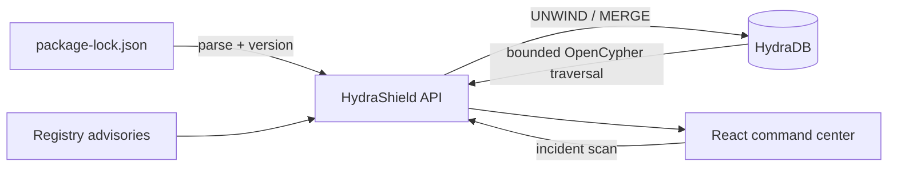

# HydraShield

HydraShield is a graph-native incident response console for software supply-chain attacks. It answers the question defenders face when a malicious package lands: **which services are exposed right now, through which exact dependency paths, and what should we contain first?**

Built for Hack Hydra 2026, Track 02A: Supply-chain blast radius.

## The demo

The included incident simulates a stolen npm automation token publishing a credential-stealing package at 09:00. By 09:06, the artifact has reached direct and transitive dependents across a service estate. HydraShield:

1. Traverses up to five dependency hops in one bounded OpenCypher query.
2. Returns every affected service and its owner, criticality and exact install path.
3. Correlates the compromised publisher with a lookalike sibling package.
4. Generates a prioritized, interactive containment plan.
5. Imports real npm v2/v3 `package-lock.json` files into HydraDB.

## Why HydraDB is essential

A vector index can find packages with similar descriptions. It cannot prove that a service resolves a compromised version through four transitive dependencies. HydraShield stores services, versioned packages, maintainers and vulnerabilities as nodes, with `DEPENDS_ON`, `MAINTAINS`, `AFFECTED_BY` and `SIMILAR_TO` relationships.

The central blast-radius query is executed by HydraDB:

```cypher
CALL algo.SSpaths({
  sourceNode: $badId,
  relTypes: ['DEPENDS_ON'],
  relDirection: 'incoming',
  maxLen: 5,
  pathCount: 100,
  resultLimit: 1000
})
YIELD path
RETURN path
```

HydraDB contributes bounded variable-length traversal, reverse adjacency, durable object-store-backed graph state, and snapshot-consistent causal reads. Without it, the product loses its core claim: exact, explainable transitive exposure at incident speed.

## Architecture



- **Web:** React 19, Vite, custom SVG dependency topology
- **API:** Express 5 and TypeScript
- **Graph:** HydraDB HTTP query API using causal, snapshot-consistent reads
- **Tests:** Vitest for lockfile ingestion and transitive closure correctness

## Run locally

Prerequisites: Node.js 22+, npm and Docker.

```bash
npm install
HYDRA_UID=$(id -u) HYDRA_GID=$(id -g) docker compose up -d hydradb
npm run seed
npm run dev
```

Open [http://localhost:5173](http://localhost:5173). The API runs at `http://127.0.0.1:8787` and HydraDB at `http://127.0.0.1:8443`.

HydraShield automatically seeds the demonstration graph when HydraDB is ready. If HydraDB is not running, the product remains explorable using a clearly labeled deterministic demo snapshot. Lockfile imports are only persisted when HydraDB is live.

## Deploy to Vercel

Vercel serves the Vite client from its CDN and routes `/api/*` to the Express entrypoint at `api/index.ts`, keeping the product on one deployment and one origin.

```bash
vercel link
vercel build --prod
vercel deploy --prebuilt --prod
```

Without remote HydraDB environment variables, the hosted demonstration uses the clearly labeled deterministic snapshot. To connect a hosted HydraDB cluster, set the `HYDRA_*` variables below in Vercel Production Environment Variables.

## Environment

The defaults match `docker-compose.yml`.

| Variable | Default | Purpose |
| --- | --- | --- |
| `HYDRA_URL` | `http://127.0.0.1:8443` | HydraDB HTTP endpoint |
| `HYDRA_ADMIN_URL` | `http://127.0.0.1:9090` | HydraDB readiness endpoint |
| `HYDRA_TOKEN` | local development token | Bearer token |
| `HYDRA_NAMESPACE` | `hydrashield` | Graph namespace |
| `HYDRA_GRAPH_ID` | `default` | Graph identifier |
| `HYDRA_CELL_ID` | `cell-0` | HydraDB cell |
| `PORT` | `8787` | API port |

Replace the committed development token before any shared or production deployment.

## Verification

```bash
npm run typecheck
npm test
npm run build
curl http://127.0.0.1:8787/api/health
```

## Project structure

```text
server/app.ts         API routes, scan orchestration and lockfile ingestion
server/hydra.ts       Typed HydraDB HTTP client and idempotent graph seeding
server/domain.ts      Lockfile parser and deterministic traversal reference
server/demo-data.ts   Synthetic, clearly scoped demonstration incident
api/index.ts          Vercel Express serverless entrypoint
src/App.tsx           Incident command center and interactive graph
src/styles.css        Responsive visual system and impact-wave motion
```

## Third-party software

- [HydraDB](https://github.com/hydra-db/hydradb), AGPL-3.0, is run as the graph database service and is not redistributed in this repository.
- React, Express, Vite, Lucide and all other npm packages retain their respective licenses. See `package-lock.json` for the complete dependency inventory.

The incident names, package names, maintainers and vulnerability identifier in the demo are synthetic.

## License

MIT
